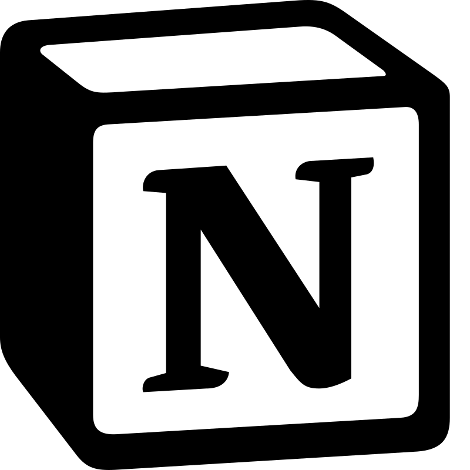

# [✨Apps Centralizer Streamlit✨](https://apps-centralizer.streamlit.app/)
<p align="left"> 
    <a href="https://share.streamlit.io/">
        </img>
    </a>
    <a href="https://app.netlify.com/teams/smdlabtech">
        </img>
    </a>
</p><br><br><br><br><br>

Pour lancer lancer l'application veuillez cliquez sur ce lien : [➡️ Apps Centralizer Streamlit](https://expensestrackerr.streamlit.app/)  
🚀 Deployer une application sur Streamlit : [➡️ docs.com](https://docs.streamlit.io/deploy/streamlit-community-cloud/deploy-your-app)  
Pour suivre toutes les étapes appliquées pour réaliser cette application, veuillez [➡️ cliquez-ici📌](demarches.md).
<p align="left"> 
Retrouver toutes les applications listées dans le <strong>Gestionnaire de Tâches.</strong>
    <a href="https://www.notion.so/1537fdac3335403d81dabe8198c02f72">
        </img>
    </a>
</p><br>


<!--------------------->
### 💡 Conseils : 
Avant de faire chaque ***commit***, pensez à éxécuter la commande suivante pour mettre à jour la documentation des fonctions, [⚙️```dev_documentations.md```](/_docs/dev_documentations.md) : 
```javascript copy
python dev_generate_docs.py
```
Here's the application architechture [➡️**diagram📂**](repo_schema.md).
